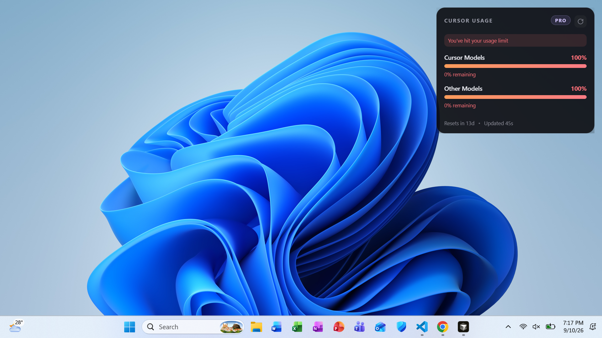

# Cursor Usage Overlay

<p align="center">
  <strong>Always-on-top desktop widget for your Cursor Pro usage bars</strong><br />
  <sub>See Cursor Models &amp; Other Models without opening the dashboard</sub>
</p>

<p align="center">
  
</p>

<p align="center">
  
  
  
  
</p>

---

## Why

Cursor’s spending dashboard shows two separate pools. Checking them mid-session breaks flow. This overlay keeps both bars on your desktop:

| Meter | What it tracks |
| --- | --- |
| **Cursor Models** | Included Auto / Cursor model usage |
| **Other Models** | Included API / premium model usage ($20 Pro) |

Bars turn amber near the limit and red when you’re critical or exhausted — same signal you’d hunt for in the dashboard.

---

## Features

- **Live Pro data** — reads your local Cursor session and the official usage API
- **Always on top** — stays visible over Cursor and other apps
- **Drag & remember** — move it; position persists across launches
- **Auto refresh** — polls every 45 seconds (manual refresh in the header / tray)
- **System tray** — hide/show, open spending dashboard, start with Windows, quit
- **Limit banner** — surfaces “You’ve hit your usage limit” when either pool is maxed

---

## Quick start

**Requirements:** Node.js **22+**, Cursor signed in on this machine.

```bash
cd C:\Users\Peter\Cursor-widget
npm install
npm start
```

| Command | What it does |
| --- | --- |
| `npm start` | Build + launch with **live** usage |
| `npm run start:demo` | Build + launch with **mock** bars (72% / 86%) |
| `npm run preview` | Browser preview of the widget UI |
| `npm test` | Unit tests |
| `npm run typecheck` | Strict TypeScript check |

---

## How it works

```text
┌─────────────────┐     ┌──────────────────────┐     ┌─────────────────┐
│  Cursor state   │────▶│  Dashboard usage API │────▶│  Electron       │
│  (local token)  │     │  Cursor / Other bars │     │  always-on-top  │
└─────────────────┘     └──────────────────────┘     └─────────────────┘
```

1. Copies your Cursor `state.vscdb` access token (read-only).
2. Calls `GetCurrentPeriodUsage` / `GetPlanInfo` on `api2.cursor.sh`.
3. Maps `autoPercentUsed` → **Cursor Models**, `apiPercentUsed` → **Other Models**.
4. Renders the glass overlay and refreshes on an interval.

No Cursor password is stored by this app; it only uses the token already present from your signed-in Cursor install.

---

## Tray menu

| Action | Description |
| --- | --- |
| Hide / Show overlay | Toggle visibility without quitting |
| Refresh now | Force a usage fetch |
| Open spending dashboard | `cursor.com/dashboard/spending` |
| Start with Windows | Login item for the overlay |
| Quit | Exit the app |

Click the footer (**Resets in … · Updated …**) to open the spending dashboard as well.

---

## Project layout

```text
Cursor-widget/
├── demo.png                 # Screenshot used above
├── src/
│   ├── main.ts              # Electron window, tray, polling
│   ├── main/                # Auth, Cursor API, settings
│   ├── renderer/            # Overlay HTML / CSS / TS
│   └── shared/              # Parse + format helpers
├── scripts/build.mjs        # esbuild → dist/
└── tests/                   # Vitest
```

---

## Notes

- Designed for **Cursor Pro** on Windows; plan badge follows your membership when available.
- If the overlay can’t find a token, sign in to Cursor Desktop and try again.
- Usage numbers match the dashboard’s two included-usage bars, not on-demand spend beyond your plan.

---

<p align="center">
  <sub>Built to keep your last percent of Pro usage visible — without another tab.</sub>
</p>
